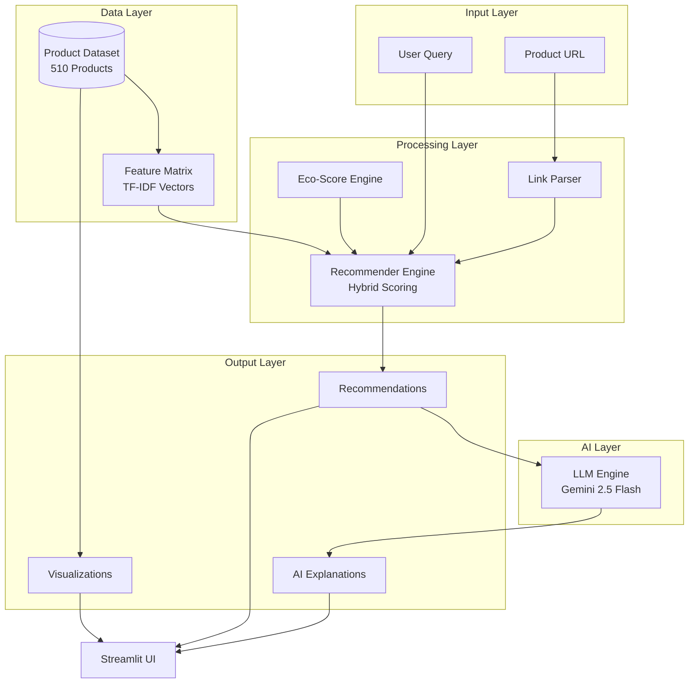

# Simple System Architecture for LaTeX Report

```mermaid
graph TB
    subgraph "Input Layer"
        UQ[User Query]
        URL[Product URL]
    end
    
    subgraph "Data Layer"
        DS[(Product Dataset<br/>510 Products)]
        FM[Feature Matrix<br/>TF-IDF Vectors]
    end
    
    subgraph "Processing Layer"
        RE[Recommender Engine<br/>Hybrid Scoring]
        ES[Eco-Score Engine]
        LP[Link Parser]
    end
    
    subgraph "AI Layer"
        LLM[LLM Engine<br/>Gemini 2.5 Flash]
    end
    
    subgraph "Output Layer"
        REC[Recommendations]
        EXP[AI Explanations]
        VIZ[Visualizations]
    end
    
    UQ --> RE
    URL --> LP
    LP --> RE
    DS --> FM
    FM --> RE
    ES --> RE
    RE --> REC
    REC --> LLM
    LLM --> EXP
    DS --> VIZ
    
    REC --> UI[Streamlit UI]
    EXP --> UI
    VIZ --> UI
```

