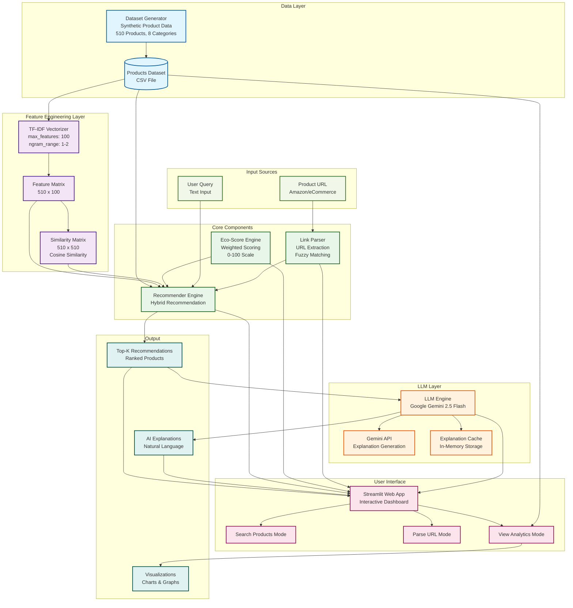
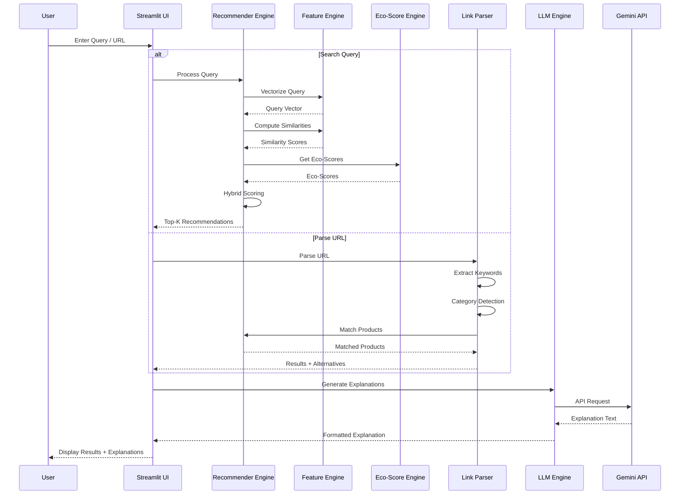
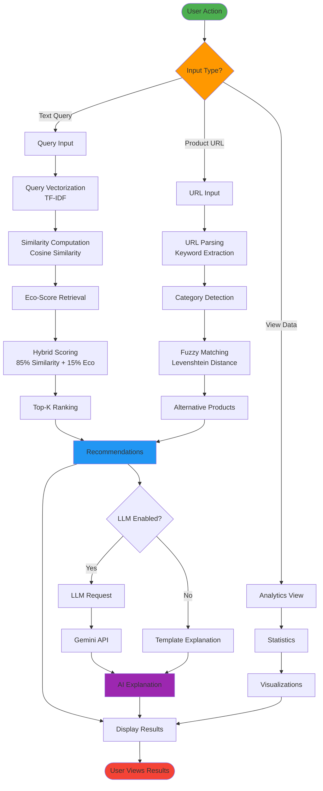

# EcoShopper Bot - System Architecture Diagram

```mermaid
graph TB
    subgraph "Data Layer"
        DG[Dataset Generator<br/>Synthetic Product Data<br/>510 Products, 8 Categories]
        DS[(Products Dataset<br/>CSV File)]
        DG --> DS
    end
    
    subgraph "Feature Engineering Layer"
        TFIDF[TF-IDF Vectorizer<br/>max_features: 100<br/>ngram_range: 1-2]
        DS --> TFIDF
        FM[Feature Matrix<br/>510 x 100]
        TFIDF --> FM
        SM[Similarity Matrix<br/>510 x 510<br/>Cosine Similarity]
        FM --> SM
    end
    
    subgraph "Core Components"
        RE[Recommender Engine<br/>Hybrid Recommendation]
        ES[Eco-Score Engine<br/>Weighted Scoring<br/>0-100 Scale]
        LP[Link Parser<br/>URL Extraction<br/>Fuzzy Matching]
    end
    
    subgraph "LLM Layer"
        LLM[LLM Engine<br/>Google Gemini 2.5 Flash]
        API[Gemini API<br/>Explanation Generation]
        LLM --> API
        CACHE[Explanation Cache<br/>In-Memory Storage]
        LLM --> CACHE
    end
    
    subgraph "User Interface"
        UI[Streamlit Web App<br/>Interactive Dashboard]
        SEARCH[Search Products Mode]
        PARSE[Parse URL Mode]
        ANALYTICS[View Analytics Mode]
        UI --> SEARCH
        UI --> PARSE
        UI --> ANALYTICS
    end
    
    subgraph "Input Sources"
        QUERY[User Query<br/>Text Input]
        URL[Product URL<br/>Amazon/eCommerce]
    end
    
    subgraph "Output"
        RECS[Top-K Recommendations<br/>Ranked Products]
        EXPL[AI Explanations<br/>Natural Language]
        VIZ[Visualizations<br/>Charts & Graphs]
    end
    
    %% Data Flow
    DS --> RE
    FM --> RE
    SM --> RE
    ES --> RE
    
    %% User Input Flow
    QUERY --> RE
    URL --> LP
    LP --> RE
    
    %% Recommendation Flow
    RE --> RECS
    RECS --> LLM
    LLM --> EXPL
    
    %% UI Integration
    RE --> UI
    ES --> UI
    LP --> UI
    LLM --> UI
    RECS --> UI
    EXPL --> UI
    DS --> ANALYTICS
    ANALYTICS --> VIZ
    
    %% Styling
    classDef dataLayer fill:#e1f5ff,stroke:#01579b,stroke-width:2px
    classDef featureLayer fill:#f3e5f5,stroke:#4a148c,stroke-width:2px
    classDef coreLayer fill:#e8f5e9,stroke:#1b5e20,stroke-width:2px
    classDef llmLayer fill:#fff3e0,stroke:#e65100,stroke-width:2px
    classDef uiLayer fill:#fce4ec,stroke:#880e4f,stroke-width:2px
    classDef inputLayer fill:#f1f8e9,stroke:#33691e,stroke-width:2px
    classDef outputLayer fill:#e0f2f1,stroke:#004d40,stroke-width:2px
    
    class DG,DS dataLayer
    class TFIDF,FM,SM featureLayer
    class RE,ES,LP coreLayer
    class LLM,API,CACHE llmLayer
    class UI,SEARCH,PARSE,ANALYTICS uiLayer
    class QUERY,URL inputLayer
    class RECS,EXPL,VIZ outputLayer
```

## Alternative: Detailed Component Diagram

```mermaid
graph LR
    subgraph "1. Data Generation"
        A1[Dataset Generator] --> A2[Product Attributes]
        A2 --> A3[Eco-Score Calculation]
        A3 --> A4[CSV Export]
    end
    
    subgraph "2. Feature Engineering"
        B1[Text Preprocessing] --> B2[TF-IDF Vectorization]
        B2 --> B3[Feature Matrix]
        B3 --> B4[Similarity Computation]
    end
    
    subgraph "3. Recommendation Engine"
        C1[Query Processing] --> C2[Vectorization]
        C2 --> C3[Similarity Search]
        C3 --> C4[Eco-Score Weighting]
        C4 --> C5[Hybrid Scoring]
        C5 --> C6[Top-K Ranking]
    end
    
    subgraph "4. URL Parser"
        D1[URL Extraction] --> D2[Keyword Parsing]
        D2 --> D3[Category Detection]
        D3 --> D4[Fuzzy Matching]
        D4 --> D5[Product Matching]
    end
    
    subgraph "5. LLM Integration"
        E1[Product Data] --> E2[Prompt Construction]
        E2 --> E3[Gemini API Call]
        E3 --> E4[Explanation Generation]
        E4 --> E5[Cache Storage]
    end
    
    subgraph "6. User Interface"
        F1[Streamlit App] --> F2[Search Interface]
        F1 --> F3[URL Parser UI]
        F1 --> F4[Analytics Dashboard]
        F2 --> F5[Results Display]
        F3 --> F5
        F4 --> F6[Visualizations]
    end
    
    A4 --> B1
    B4 --> C1
    C6 --> E1
    D5 --> C1
    E5 --> F5
    C6 --> F5
```

## System Flow Diagram

```mermaid
sequenceDiagram
    participant User
    participant UI as Streamlit UI
    participant RE as Recommender Engine
    participant FE as Feature Engine
    participant ES as Eco-Score Engine
    participant LP as Link Parser
    participant LLM as LLM Engine
    participant API as Gemini API
    
    User->>UI: Enter Query / URL
    alt Search Query
        UI->>RE: Process Query
        RE->>FE: Vectorize Query
        FE-->>RE: Query Vector
        RE->>FE: Compute Similarities
        FE-->>RE: Similarity Scores
        RE->>ES: Get Eco-Scores
        ES-->>RE: Eco-Scores
        RE->>RE: Hybrid Scoring
        RE-->>UI: Top-K Recommendations
    else Parse URL
        UI->>LP: Parse URL
        LP->>LP: Extract Keywords
        LP->>LP: Category Detection
        LP->>RE: Match Products
        RE-->>LP: Matched Products
        LP-->>UI: Results + Alternatives
    end
    UI->>LLM: Generate Explanations
    LLM->>API: API Request
    API-->>LLM: Explanation Text
    LLM-->>UI: Formatted Explanation
    UI-->>User: Display Results + Explanations
```

## Component Interaction Diagram

```mermaid
graph TD
    START([User Action]) --> DECIDE{Input Type?}
    
    DECIDE -->|Text Query| QUERY[Query Input]
    DECIDE -->|Product URL| URL[URL Input]
    DECIDE -->|View Data| ANALYTICS[Analytics View]
    
    QUERY --> VEC[Query Vectorization<br/>TF-IDF]
    VEC --> SIM[Similarity Computation<br/>Cosine Similarity]
    SIM --> ECO[Eco-Score Retrieval]
    ECO --> HYBRID[Hybrid Scoring<br/>85% Similarity + 15% Eco]
    HYBRID --> RANK[Top-K Ranking]
    
    URL --> PARSE[URL Parsing<br/>Keyword Extraction]
    PARSE --> CAT[Category Detection]
    CAT --> FUZZY[Fuzzy Matching<br/>Levenshtein Distance]
    FUZZY --> ALT[Alternative Products]
    
    RANK --> RESULTS[Recommendations]
    ALT --> RESULTS
    
    RESULTS --> LLM_CHECK{LLM Enabled?}
    LLM_CHECK -->|Yes| LLM_REQ[LLM Request]
    LLM_CHECK -->|No| TEMPLATE[Template Explanation]
    
    LLM_REQ --> GEMINI[Gemini API]
    GEMINI --> EXPL[AI Explanation]
    TEMPLATE --> EXPL
    
    ANALYTICS --> STATS[Statistics]
    STATS --> CHARTS[Visualizations]
    
    RESULTS --> DISPLAY[Display Results]
    EXPL --> DISPLAY
    CHARTS --> DISPLAY
    
    DISPLAY --> END([User Views Results])
    
    style START fill:#4caf50
    style END fill:#f44336
    style DECIDE fill:#ff9800
    style RESULTS fill:#2196f3
    style EXPL fill:#9c27b0
```

